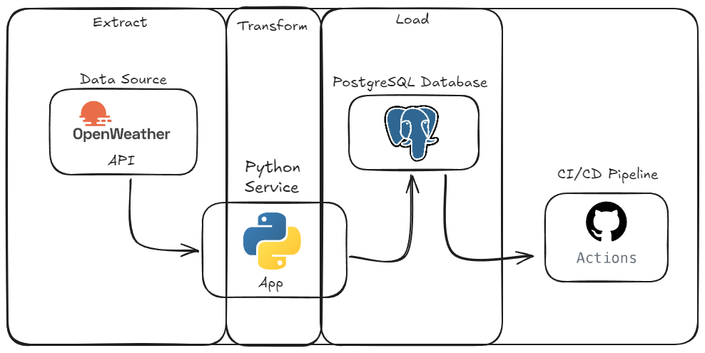

# Weather Data Pipeline
A Weather Data pipeline using [Open Weather API](https://openweathermap.org/) for consuming data that is transformed and loaded in a Postgres Database.

## Current Data Pipeline Workflow



## Environment

### Docker
A docker environment has been set up with `postgres` and `python` services.
[Dockerfile](Dockerfile) is responsible for setting a python image for the `app` service, and installing dependencies according to [requirements.txt](requirements.txt).
[Docker Compose](docker-compose.yml) uses the Dockerfile to build a image for the `app` service. It also defines and configures both `postgres` and `python` services and how they interact.

Run the commands below `Git Bash` on Windows or any other shell of your interest:
```
docker-compose build
```

```
docker-compose up -d
```

```
winpty docker exec -it weather_python sh
```


### Venv Alternative
Python Venv can be used as well. It can be setup by following the [python venv documentation](https://docs.python.org/3/library/venv.html) for different operating systems.
Run the following commands using `Git Bash` on Windows or any other shell of your interest:

```
python -m venv .venv
source .venv/Scripts/activate
```
After setting up the virtual environment, execute 

```
pip install -r requirements.txt
```

## Project

### ETL
Weather ETL pipeline that [extracts](scripts\extract.py) data from different cities from the [Open Weather API](https://openweathermap.org/), with informations of temperature in fahrenheit, humidity, pressure, weather, wind speed and datetime, and it is stored in a [parquet](data\raw\weather_data.parquet) file.

The [transform](scripts\transform.py) script add a new column with the temperature converted to Celsius and than it's stored in a new [parquet](data\processed\weather_data_transformed.parquet).

The [load](scripts\load.py) script is responsible for loading data in postgreSQL with sqlalchemy.

We have a [main](scripts/main.py) file that is responsible for orchestrating the pipeline and triggering all the ETL process in a synchronized way.

### Tools
A [docker-compose](docker-compose.yml) was used to setup a postgres database through the command:
```
docker-compose up -d
```

[Beekeeper Studio](https://www.beekeeperstudio.io/) was used to visualize and manipulate data after the ETL process and can be used to query data. Some beekeeper usage can be found at [beekeeper](docs/beekeeper/tutorial.md) tutorial.

### Visualization

A [Data Visualization and Analysis Page](analysis\report.md) was used to plot some graphics about the data such as hystogram and scatter plots. The script can be found at `analysis\data_analysis.py`


## Tests

[Pytest](https://docs.pytest.org/en/stable/) is being used for unit testing the ETL functions.

Tests can be run by the command in the shell:
```
pytest tests/
```
And the output will be displayed in shell.
