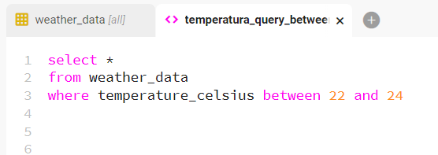

# Beekeeper Tutorial

- Follow Beekeeper [installation guide](https://www.beekeeperstudio.io/).
- Open Beekeeper app after installed.
- Create a New Coneection.
- Select "PostgreSQL" as connection type.
- Fill the details:
    -  Hostname: localhost
    -  Port: 5432
    - Database: weather_db
    - Username: username
    - Password: password
- Test connection and then save it.

After the ETL process, depending on the cities of choice, the result should be something like this:

A query example could be something like this:

